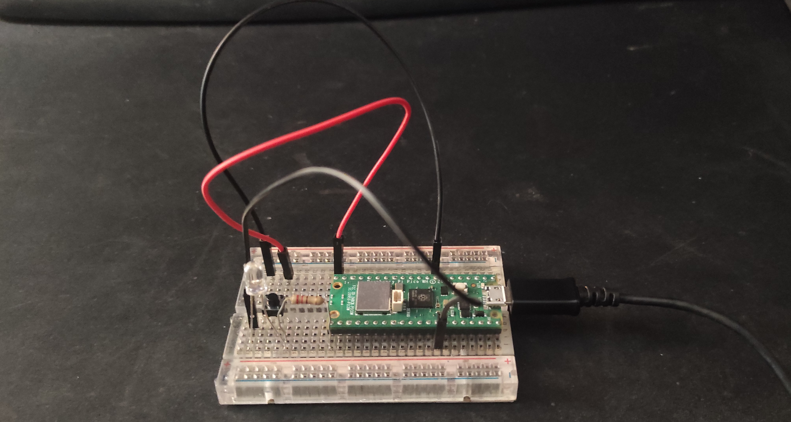

# Raspberry Pi Pico LED Blinker Using Interrupts
A simple project which demonstrates the use of interrupts on the Raspberry Pi Pico, to control an LED. By using interrupts to toggle the state of the LED a more efficient design is implemented which minimizes CPU usage.
## Componenets Used
* Raspberry Pi Pico W
* Breadboard
* 4-pin Push Button
* White 5mm LED
* 220 Ω Resistor
* Jumper Wires\

The LED is connected to GPIO 16, which is physical pin number 21, and the button is connected to GPIO 15, which is physical pin number 20.
## Implementation
When the button is pressed GPIO 15 is grounded and the interupt service routine(ISR) is called. The ISR changes the state of the LED. In that way a push of the button toggles the LED state between on and off. To make the interrupt procedure easier to monitor, main function prints the phrase "Hello!" every one second and the ISR prints "Interrupt" every time it's called. I/O can be monitored by using minicom.
## Flag branch
I also created a branch called "flag" which modifies the program. When the button is pressed now, a flag is raised that the main function sees and calls a function to turn the LED on for half a second. This method does not toggle the LED state, it makes it blink.
<<<<<<< HEAD
=======
## Images
An image of the breadboard layout is presented below.

>>>>>>> fcc9b87 (main project)
